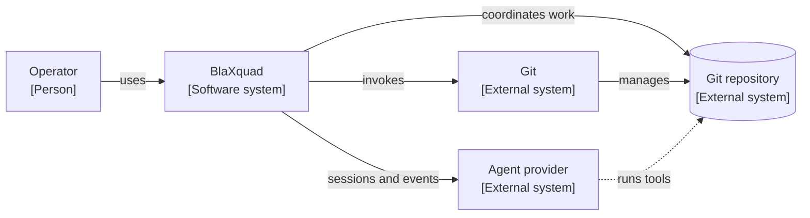
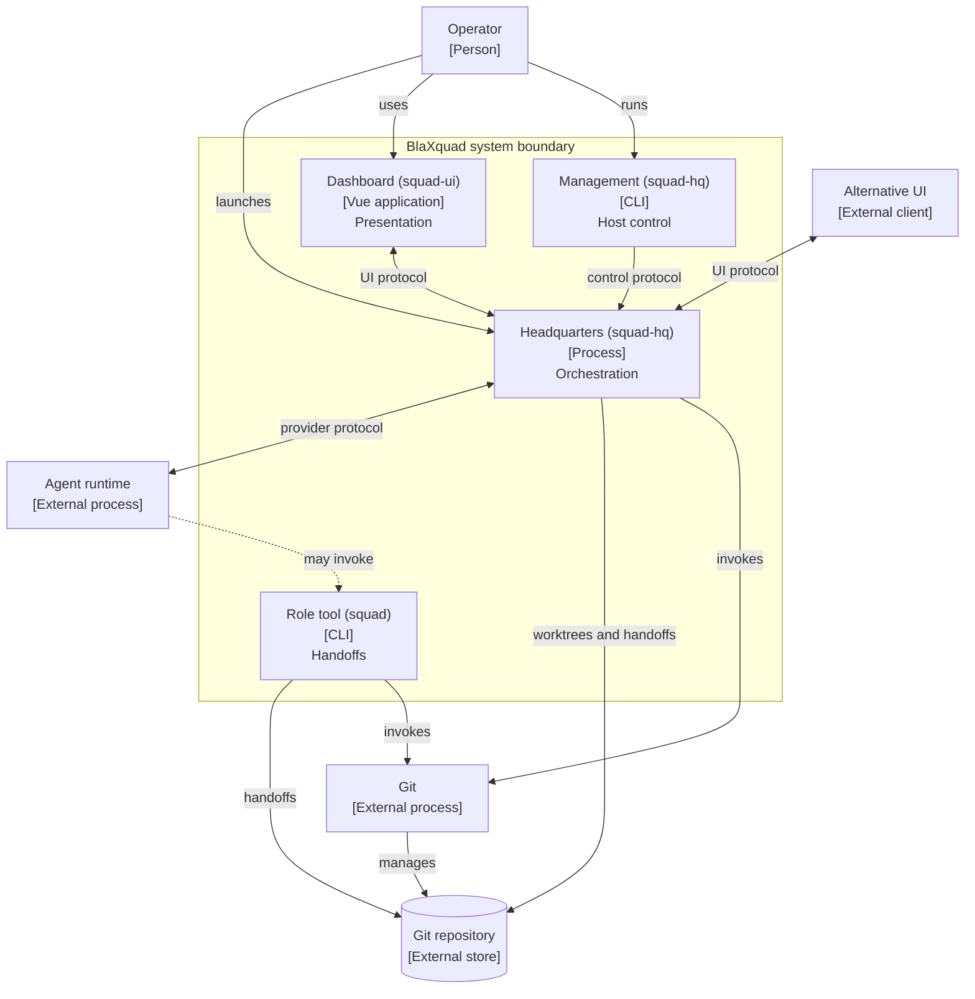
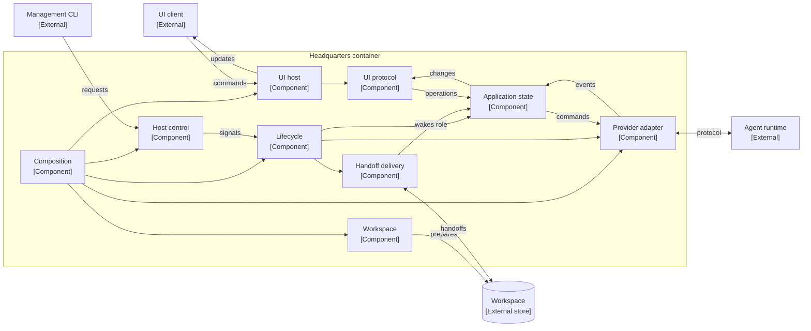
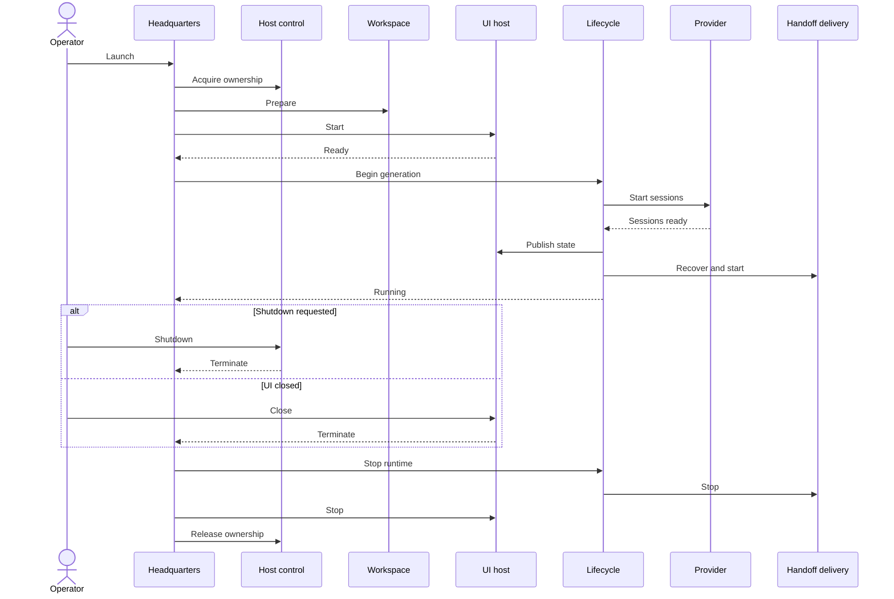
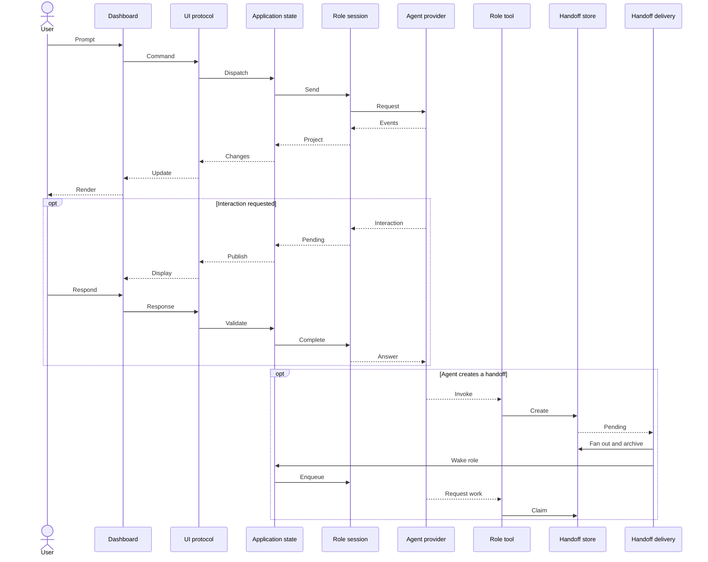

# Architecture

## Executive model

BlaXquad is a local orchestration system for a configurable group of coding-agent roles working in one Git
repository. A single headquarters process owns the running squad. It prepares role worktrees, starts one provider
session per role, maintains authoritative role state, presents that state through a UI protocol, and delivers
durable handoffs between roles.

A separate role-facing command-line tool lets agents discover their context and manage handoff work. The two
executables do not communicate directly. They coordinate through Git and per-worktree handoff queues.

There are three independent coordination protocols:

1. A versioned UI protocol between headquarters and presentation clients.
2. A local host-control protocol for readiness and shutdown.
3. A filesystem handoff protocol for durable work exchange between roles.

There is no application database or network server. Git and handoff files are durable; provider sessions,
interactions, projected role state, and transcript history belong to one headquarters run.

## C4 level 1: System context

The target repository is outside the BlaXquad boundary: it remains the user's source of truth even though BlaXquad
creates worktrees and runtime state within it. The agent provider is also external. BlaXquad owns the provider
adapter and lifecycle contract, but not model execution, authentication, remote communication, or tool execution.

## C4 level 2: Containers

### Headquarters

`squad-hq launch` is the composition root and the only long-running BlaXquad backend process. It enforces one active
host per project, prepares the workspace, selects UI and provider adapters, starts role sessions, maintains
authoritative state, delivers handoffs, and coordinates cleanup.

The same executable also provides short-lived `shutdown` and `wait-for-agent` commands. Those commands are clients
of the running headquarters process rather than alternate host modes.

### Dashboard

`squad-ui` is a static Vue application hosted by the default Photino adapter. It renders role status, transcripts,
usage, prompts, and pending interactions. It owns presentation concerns such as drafts, focus, scrolling,
virtualization, and client-side transcript reconciliation. It does not own agent or workflow state.

Headquarters can instead expose the same UI protocol over standard input and output. This supports non-visual clients
without introducing a separate server.

### Role tool

`squad` runs within a role worktree. It resolves the current role from Git context, creates outbound handoffs, and
claims or completes inbound tasks or batches. It does not call headquarters directly; the handoff filesystem is the
integration boundary.

### Agent provider

The provider adapter is loaded into the headquarters process through a provider-neutral plug-in contract. The
default adapter connects to a child Copilot runtime and creates one logical provider session per configured role.
One runtime generation owns the shared provider connection and every role session created from it.

## Architectural contracts

- **UI contract.** A versioned JSON protocol carries commands toward authoritative application state and carries
  snapshots, transcript synchronization, incremental transcript updates, history pages, and errors back to the
  client. Photino web messages and line-delimited stdio are transport adapters for the same protocol.
- **Host-control contract.** A project-specific local named pipe accepts readiness and shutdown requests. A file
  lock establishes one headquarters owner for the project, while local metadata supports process discovery and
  stale-state cleanup.
- **Provider contract.** A provider-neutral factory, backend, runtime, and session model separates headquarters from
  the Copilot implementation. Sessions accept prompts, aborts, and interaction responses and publish ordered typed
  events.
- **Handoff contract.** Validated files and atomic filesystem moves define queue state. The role tool produces and
  consumes queue entries; headquarters fans them out to recipient worktrees, archives delivery outcomes, and wakes
  active recipients.
- **Workspace contract.** Configuration defines roles, worktrees, receive modes, provider settings, and prompts.
  Git supplies role isolation, role-context discovery, and the commits referenced by code handoffs.

## C4 level 3: Headquarters components

### Responsibility boundaries

- **Lifecycle coordination** owns the process phase, command admission, the current provider-runtime generation,
  session registration, event observation, startup completion, and ordered teardown.
- **Application model** owns the authoritative projection for every role. It serializes state changes, coordinates
  concurrent operations per role, records pending interactions, and derives transcripts from provider events.
- **Provider adapter** translates the provider-neutral session model into the selected provider. Provider-specific
  event types and callbacks do not cross into the application model.
- **UI protocol** translates between JSON messages and application operations. It controls snapshot publication,
  transcript ordering, synchronization, and recovery independently of the selected UI transport.
- **Workspace management** owns launch-time configuration validation and Git worktree preparation. The role tool
  performs later role-local queue transitions against the prepared workspace.
- **Handoff delivery** owns cross-role fan-out and notification. Persisting recipient copies is authoritative;
  notification is a best-effort wake-up and does not determine whether delivery succeeded.

## Runtime: startup and shutdown

The UI-ready handshake precedes provider-session startup. The system does not enter its running phase until all
sessions are registered, initial UI publication has been requested, pending handoff notifications have been
recovered, and delivery is active.

## Runtime: interaction and handoff

The prompt, event, interaction, and queue transitions are implemented by BlaXquad. The agent provider's decision to
invoke the role tool is outside the repository: BlaXquad makes the tool available, assigns the role worktree, and
supplies instructions, but does not directly call the tool on an agent's behalf.

## State ownership and durability

- **Squad configuration** is checked-in project state. It defines roles and their execution settings and is read at
  startup; it is not dynamically watched.
- **Source and commits** remain owned by Git. Roles work in the main checkout or dedicated worktrees. A normal launch
  resets dedicated worktrees and queues; a continued launch preserves them.
- **Handoff queues** are durable per-worktree state. Filesystem moves are the authoritative task, batch, delivery,
  and completion transitions.
- **Host ownership** is local runtime state backed by a project lock, process metadata, and a named-pipe endpoint.
- **Role and interaction state** is authoritative in the headquarters application model and exists only for the
  current process.
- **Transcript state** is bounded. Recent content is held in memory and older content is paged from a private
  temporary archive; both disappear when headquarters shuts down.
- **Dashboard state** is transient presentation state. Drafts, scroll position, focus, and local transcript caches
  can be reconstructed or discarded without changing backend truth.

For the implementation-module inventory, see [Modules](modules.md).

## Architectural characteristics and pressure points

These observations describe current consequences of the design; they are not redesign proposals.

1. **Single local authority.** One headquarters process owns one project. Local locking, named pipes, worktrees, and
  in-memory state make this a single-machine architecture rather than a distributed service.
2. **Central application model.** All role commands, provider events, interactions, and transcript changes converge
  on one authoritative model and one state-serialization point. This gives clear ordering but couples those flows
  operationally.
3. **Filesystem collaboration contract.** The two executables depend on shared naming, header, ordering, and atomic
  move conventions. This makes handoffs durable and restart-safe while coupling independently running processes to
  the same filesystem schema.
4. **Cross-language UI contract.** C# and TypeScript maintain the same versioned message shapes independently. The
  protocol is explicit, but there is no generated shared schema.
5. **In-process provider plug-ins.** Provider neutrality is enforced by contracts, but plug-ins execute inside
  headquarters. The default provider also shares one child runtime across all role sessions, creating a common
  failure domain.
6. **UI-gated startup.** A UI client must complete its ready handshake before provider sessions start. Presentation
  availability is therefore part of backend startup, including in stdio mode.
7. **Asymmetric durability.** Git state and preserved handoffs survive process replacement; live sessions,
  interactions, role projections, and transcripts do not.
8. **Concentrated composition.** Workspace, lifecycle, provider, UI, handoff, and host-control implementations are
  selected together by the headquarters composition root, so cross-cutting startup changes converge there.

## Confidence and external unknowns

The process boundaries, dependency directions, startup ordering, state ownership, and file/protocol interactions
shown with solid arrows are verified from the product entry points and runtime implementations.

The default provider is known to start a child runtime and configure one session per role. Its cloud protocol,
authentication, model execution, tool sandboxing, and retry behavior are external and are not asserted here.
Likewise, role agents are instructed and equipped to invoke `squad`, but the provider owns whether and when a model
chooses to do so.