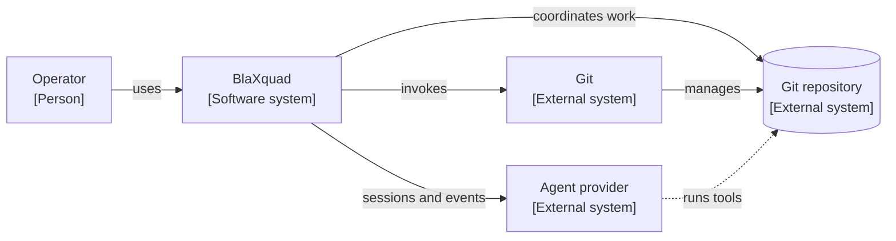
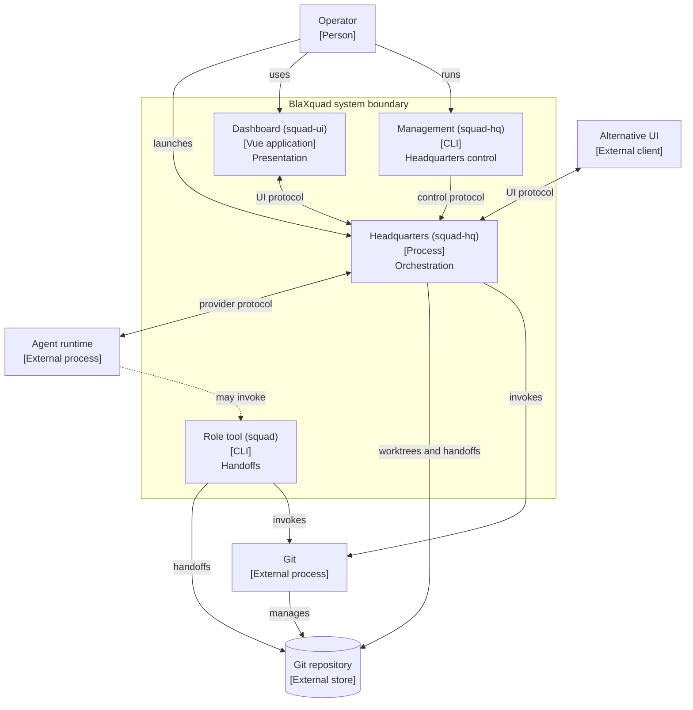
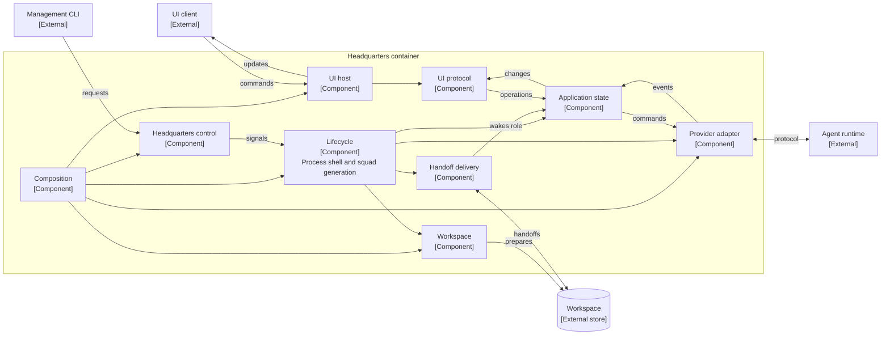
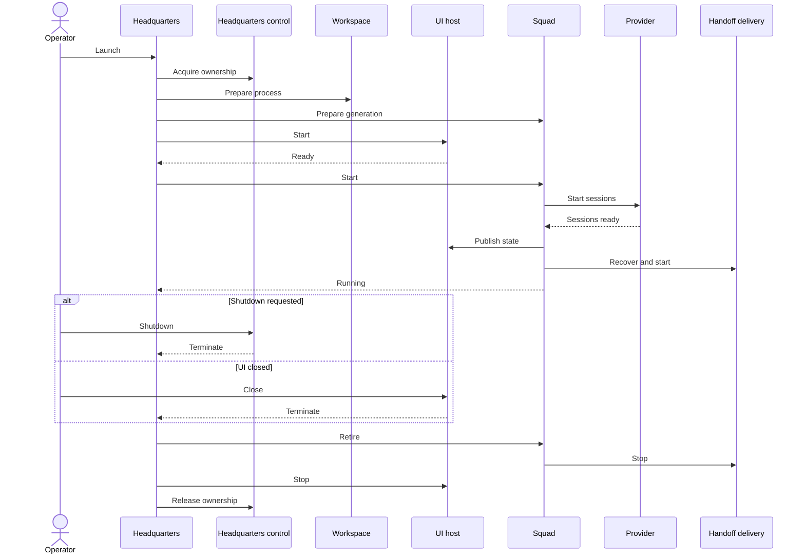
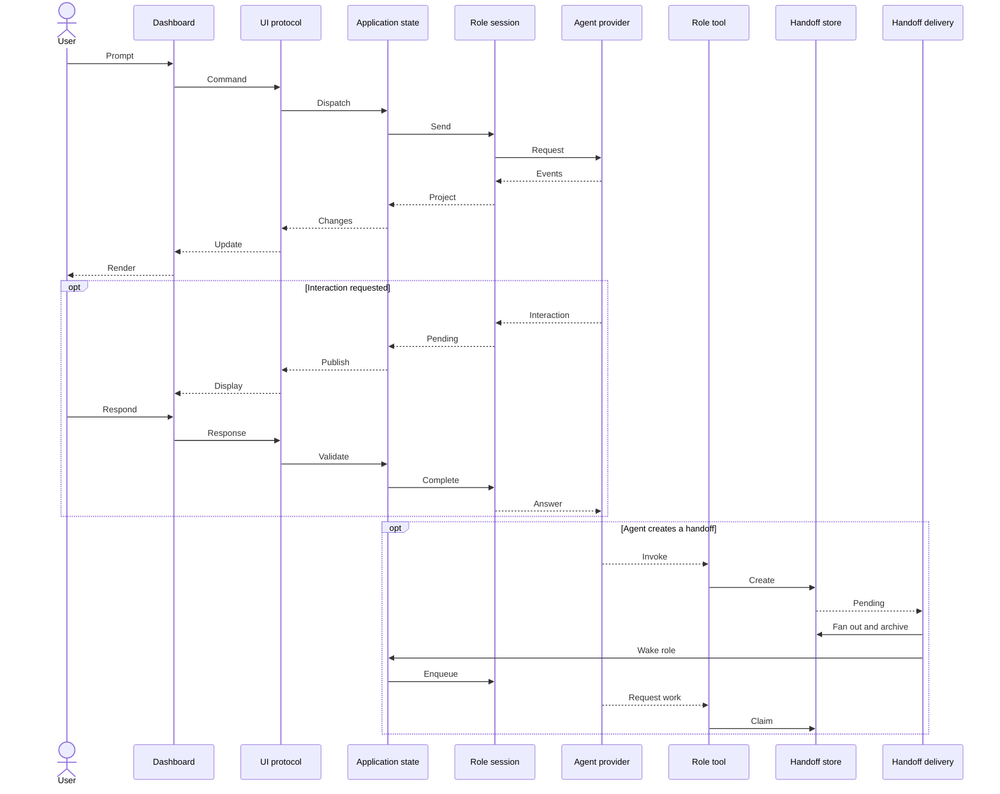

# Architecture

## Executive model

BlaXquad is a local orchestration system for a configurable group of uniquely named squad members, each referencing
a reusable coding-agent role, working in one Git repository. A single headquarters process owns the running squad.
It prepares each member's worktree, starts one provider session per member, maintains authoritative member state,
presents that state through a UI protocol, and delivers durable handoffs between members.

A separate role-facing command-line tool lets agents discover their context and manage handoff work. The two
executables do not communicate directly. They coordinate through Git and per-worktree handoff queues.

There are three independent coordination protocols:

1. An internal UI protocol between headquarters and the packaged presentation client.
2. A local Headquarters-control protocol for readiness and shutdown.
3. A filesystem handoff protocol for durable work exchange between members.

There is no application database or network server. Git and handoff files are durable; provider sessions,
interactions, projected member state, and transcript history belong to one headquarters run.

## C4 level 1: System context

The target repository is outside the BlaXquad boundary: it remains the user's source of truth even though BlaXquad
creates worktrees and runtime state within it. The agent provider is also external. BlaXquad owns the provider
adapter and lifecycle contract, but not model execution, authentication, remote communication, or tool execution.

## C4 level 2: Containers

### Headquarters

`squad-hq launch` is the composition root and the only long-running BlaXquad backend process. It enforces one active
Headquarters instance per project, prepares the workspace, selects UI and provider adapters, starts role sessions,
maintains authoritative state, delivers handoffs, and coordinates cleanup.

The same executable also provides short-lived `shutdown` and `wait-for-agent` commands. Those commands are clients
of the running headquarters process rather than alternate Headquarters modes.

### Dashboard

`squad-ui` is a static Vue application hosted by Photino, the packaged default hosting adapter. It renders role
status, transcripts, usage, prompts, and pending interactions. It owns presentation concerns such as drafts, focus,
scrolling, virtualization, and client-side transcript reconciliation. It does not own agent or workflow state.

### Role tool

`squad` runs within a role worktree. It resolves the current role from Git context, creates outbound handoffs, and
claims or completes inbound tasks or batches. It does not call headquarters directly; the handoff filesystem is the
integration boundary.

### Hosting adapter

The window-hosting adapter is loaded into the headquarters process through a hosting-neutral plug-in contract,
exactly like the agent provider. Omitting `--hosting` resolves the packaged default Photino adapter; headquarters
never references any concrete hosting assembly at compile time. Publishing packages Photino's assembly, its
dependency manifest, private managed dependencies, native runtime assets, built Vue distribution, and window icon
alongside the executable so the default resolves without a project reference. A stdio-framed adapter used only by the
backend acceptance harness is loaded the same way through an explicit descriptor.

### Agent provider

The provider adapter is loaded into the headquarters process through a provider-neutral plug-in contract. The
default adapter connects to a child Copilot runtime and creates one logical provider session per configured squad
member. One runtime generation owns the shared provider connection and every member session created from it.

## Architectural contracts

- **UI contract.** An internal JSON protocol shared by the packaged dashboard and Headquarters carries commands
  toward authoritative application state and carries snapshots, transcript synchronization, incremental transcript
  updates, history pages, and errors back to the client. Photino web messages are the packaged default transport
  for this protocol; the backend acceptance harness loads a test-distributed, line-delimited-stdio transport for
  the same protocol through an explicit descriptor, never as a supported product presentation mode.
- **Headquarters-control contract.** A project-specific local named pipe accepts readiness and shutdown requests. A file
  lock establishes one headquarters owner for the project, while local metadata supports process discovery and
  stale-state cleanup.
- **Provider contract.** A provider-neutral factory, backend, runtime, and session model separates headquarters from
  the Copilot implementation. Sessions accept prompts, aborts, and interaction responses and publish ordered typed
  events.
- **Hosting contract.** A hosting-neutral factory and runtime model separates headquarters from any concrete window
  adapter. Omitting `--hosting` runtime-loads the packaged default Photino adapter; an explicit descriptor selects
  any other adapter, such as the stdio adapter the backend acceptance harness uses.
- **Handoff contract.** Validated files and atomic filesystem moves define queue state. The role tool produces and
  consumes queue entries; headquarters fans them out to recipient worktrees, archives delivery outcomes, and wakes
  active recipients.
- **Workspace contract.** Configuration defines a catalog of reusable roles and the uniquely named squad members
  that reference them, each with its own worktree, receive mode, and agent settings. The squad leader is a
  configured member (explicit, or the first configured member by default). Git supplies member isolation,
  role-context discovery, and the commits referenced by code handoffs.

## C4 level 3: Headquarters components

### Responsibility boundaries

- **Lifecycle coordination** is split by lifetime. The process shell owns the project lease and control endpoint,
  the window and UI transport, sleep inhibition, the durable workspace services, the transcript archive, and one
  serialized active-squad slot. One squad generation owns everything whose lifetime follows it: its configuration
  snapshot and generation identity, the member directory and processors, command admission, the provider backend,
  its sessions and session observers, and handoff-pump participation. The shell never dismantles those resources
  in individual steps; it starts a generation through one start operation and releases it through one idempotent,
  failure-collecting retirement that closes admission, stops handoff participation, drains processors and
  observers, and then retires the provider runtime. A retirement that cannot conclude keeps its generation owned,
  so a replacement can never overlap it. Today exactly one generation is installed, at startup, and retired once,
  at shutdown.
- **Application model** owns an ordered directory of configured members, keyed only by member identity - the only
  application-domain collection keyed that way. After routing selects a member, one per-member aggregate is the
  sole mutable owner of that member's projected status (`squad.Domain`'s `SquadMemberStatus` enum), provider-session
  association, transcript, pending interactions, and operation/abort/failure state; its local collections are keyed
  only by request or operation identity, never by another member or role. Each member also owns an independent
  processor: a bounded, single-
  reader mailbox that is the sole path through which that member's commands and provider events reach its
  aggregate, so one member's slow or blocked provider call can never delay another member's mailbox. That
  directory belongs to the squad generation that created it and carries its generation identity, so every command,
  provider event, readiness observation, transcript mutation, and handoff wake-up is bound to one generation and
  rejected once it is retired. The process-lifetime facade above it holds no member state: it admits or rejects
  commands, forwards each one to the currently installed generation, and composes the immutable per-member
  snapshots those aggregates produce into the squad-wide read model published at the unchanged version-5 UI
  boundary - answering as an empty squad while no generation is installed.
- **Transcript history** is owned by the process shell, not by a generation. Each generation and member reaches it
  only through a bounded handle that carries the generation identity and is revoked at retirement, so a retired
  member cannot publish while everything it already published stays readable and per-member publication identity
  stays monotonic.
- **Provider adapter** translates the provider-neutral session model into the selected provider. Provider-specific
  event types and callbacks do not cross into the application model.
- **UI protocol** translates between JSON messages and application operations. It controls snapshot publication,
  transcript ordering, synchronization, and recovery independently of the selected UI transport.
- **Workspace management** owns launch-time configuration validation and Git worktree preparation. The role tool
  performs later role-local queue transitions against the prepared workspace.
- **Handoff delivery** owns cross-role fan-out and notification. Persisting recipient copies is authoritative;
  notification is a best-effort wake-up and does not determine whether delivery succeeded.

## Runtime: startup and shutdown

The UI-ready handshake precedes provider-session startup. The system does not enter its running phase until all
sessions are registered, initial UI publication has been requested, pending handoff notifications have been
recovered, and delivery is active. Process preparation - repository checks, workspace and worktree preparation,
and durable handoff directories - runs once per process, while generation preparation reloads the current
configuration and role prompts and builds the backend and member context a squad is created from.

## Runtime: interaction and handoff

The prompt, event, interaction, and queue transitions are implemented by BlaXquad. The agent provider's decision to
invoke the role tool is outside the repository: BlaXquad makes the tool available, assigns the role worktree, and
supplies instructions, but does not directly call the tool on an agent's behalf.

## State ownership and durability

- **Squad configuration** is checked-in project state. It defines a catalog of reusable roles and the uniquely
  named squad members that reference them, each member's worktree and execution settings, and the leader member
  (explicit, or the first configured member by default). It is read at startup; it is not dynamically watched.
- **Source and commits** remain owned by Git. Members work in the main checkout or dedicated worktrees. A normal launch
  resets dedicated worktrees to the current `HEAD`; a continued launch preserves that worktree content unchanged.
- **Handoff queues** are file-backed state serialized as typed JSON documents (`.handoff.json`). Filesystem moves are
  the authoritative task, batch, delivery, and completion transitions within one Headquarters run. Handoffs are
  launch-scoped, not restart-safe: every launch, continued or not, discards each configured worktree's complete
  handoff-state directory before any role session starts or delivery polling runs, so "--continue" preserves only
  worktree (Git) content.
- **Headquarters ownership** is local runtime state backed by a project lock, process metadata, and a named-pipe endpoint.
- **Role and interaction state** is authoritative in the headquarters application model, owned per member by that
  member's aggregate, and exists only for the current process.
- **Transcript state** is bounded. Recent content is held in memory and older content is paged from a private
  temporary archive; both disappear when headquarters shuts down.
- **Dashboard state** is transient presentation state. Drafts, scroll position, focus, and local transcript caches
  can be reconstructed or discarded without changing backend truth.

For the implementation-module inventory, see [Modules](modules.md).

## Typed values and retained strings

A string is appropriate while it represents open text or an external encoding. It is replaced with a dedicated
type once application code already knows it represents one closed choice or one specific kind of identity. Every
such boundary parses the incoming string once, keeps the typed value through the owning code, and formats it back
to text only where an external representation (JSON, CLI, filesystem, or another process) requires it.

Closed application choices are enums owned by the module that decides them, never re-derived from string
comparison once parsed: `PermissionMode`, `ReceiveMode`, and `SquadMemberStatus` (`squad.Domain`); `ElicitationMode`
and `ElicitationAction` (`squad.AgentProvider.Abstractions`, mapped from provider/wire spellings in
`CopilotSdkClient` and `UiCommandHandler`); `TranscriptSource` (mapped from projected agent events in
`MemberEventProjector`, formatted back to its stable lowercase spelling only in `TranscriptProtocol` and
`TranscriptArchive`); `HandoffKind` (mapped once from the CLI's `commit`/`note` token and from persisted JSON);
`AgentReadinessStatus` (mapped once in `HeadquartersControlClient` from the control protocol's
`ready`/`not-ready`/`unknown-role`/`initializing` tokens, local to `squad.Runtime.Control`); and
`RejectedCommandEffect` (`squad.Specs`, describing which provider effect a rejected UI command must never produce).
Application-owned identities are likewise typed rather than passed as bare strings: `RoleId` and `SquadMemberId`
(`squad.Domain`), `InteractionRequestId` and `ToolCallId` (`squad.AgentProvider.Abstractions`), and `HandoffId`,
`HandoffPriority`, and `GitCommitId` (`squad.Handoffs`). Shutdown is an explicit `OperationCanceledException`
carrying its existing user-facing message, not a message-text comparison, so `SessionGeneration` and every command
path branch on exception type.

Several categories of string remain deliberately untyped:

| Category | Examples | Why it remains text |
| --- | --- | --- |
| Raw configuration | `SquadConfigurationDocument`, member/agent document DTOs, raw receive mode used for diagnostics | Input DTOs must represent missing, empty, and unsupported values before validation. |
| UI and control wire formats | `UiMessage`, serialized envelope `type`/`role`/`requestId`, Vue protocol interfaces, Headquarters control JSON | These are stable external encodings. Parse at dispatch and format at publication; do not expose C# enum member names as the protocol. |
| Fake-provider control protocol | Command/event kinds, raw IDs, and `JsonElement` payloads | This is a cross-process test protocol and must inject malformed or future values. Any enums belong locally to the fixture after parsing, not in `squad.Domain`. |
| Gherkin and black-box observations | Step parameters, table headers/cells, raw JSON builders, stdout/status/operation assertions | Specs must express invalid input and assert exact public text without importing production serialization behavior. |
| Frontend presentation state | Member-keyed Vue maps and lowercase status/source strings received from the protocol | Vue owns transient presentation and protocol reconciliation, not authoritative member identity or domain validation. TypeScript string unions may document the wire vocabulary without duplicating C# rules. |
| Human-authored text | Prompts, transcript content, reasoning, errors, display names, task names, note messages | These values are open text, not identities or closed choices. Validate bounded fields without inventing enums. |
| Provider/plugin vocabulary | Model, effort, tool, skill and agent names; provider/hosting assembly and type descriptors | These sets are external, extensible, or selected by plug-ins. A core enum would reject valid future values. |
| Platform values | Filesystem paths, environment variables, process arguments/output, Git revision input and command output | The operating system, process, and Git APIs are string boundaries. Domain IDs are formatted only when entering them. |
| CLI syntax | Option names, command-line arguments, and parser option dictionaries | Tokens are strings while parsing. Closed choices become typed immediately after successful parsing. |
| Opaque external IDs | Provider session IDs (`IAgentSession.SessionId`) and UI request correlation IDs that are only echoed | No application invariant or cross-kind operation is performed on them; wrapping every pass-through identifier would add ceremony without preventing a current mistake. |
| Token tables | Known tool names, shared assembly names, supported Gherkin columns, and JSON property names | These sets classify open external names or validate an external shape; they are not collections of domain entities. |
| Test context slots | `ScenarioWorkspace.myValues` keys | This is a heterogeneous fixture property bag addressed by private constant keys, not member identity. Prefer dedicated typed fixture state when a value gains behavior, but no domain ID or enum describes the keys. |

## Architectural characteristics and pressure points

These observations describe current consequences of the design; they are not redesign proposals.

1. **Single local authority.** One headquarters process owns one project. Local locking, named pipes, worktrees, and
  in-memory state make this a single-machine architecture rather than a distributed service.
2. **Central application model.** All role commands and provider events converge on one facade, which routes each to
  the addressed member's own processor and aggregate. State and command/event serialization are both owned
  independently per member - one processor and aggregate per member owns that member's mailbox ordering, status,
  transcript, interactions, and operation/abort/failure state - so one member's command or event flow no longer
  couples operationally with any other member's.
3. **Filesystem collaboration contract.** The two executables depend on shared naming, JSON schema, ordering, and
  atomic move conventions. This makes handoffs durable within one Headquarters run while coupling independently
  running processes to the same filesystem schema; queues are launch-scoped rather than restart-safe, so every
  launch discards prior queue state instead of needing a dual-format reader or migration path.
4. **Cross-language UI contract.** C# and TypeScript maintain the same internal message shapes independently as
  one packaged product artifact. The protocol is explicit, but there is no generated shared schema.
5. **In-process provider plug-ins.** Provider neutrality is enforced by contracts, but plug-ins execute inside
  headquarters. The default provider also shares one child runtime across all role sessions, creating a common
  failure domain.
6. **UI-gated startup.** A UI client must complete its ready handshake before provider sessions start. Presentation
  availability is therefore part of backend startup, including in stdio mode.
7. **Asymmetric durability.** Git state survives process replacement; queued handoffs, live sessions, interactions,
  role projections, and transcripts do not - every launch starts handoff queues fresh.
8. **Concentrated composition.** Workspace, lifecycle, provider, UI, handoff, and Headquarters-control implementations are
  selected together by the headquarters composition root, so cross-cutting startup changes converge there.

## Confidence and external unknowns

The process boundaries, dependency directions, startup ordering, state ownership, and file/protocol interactions
shown with solid arrows are verified from the product entry points and runtime implementations.

The default provider is known to start a child runtime and configure one session per role. Its cloud protocol,
authentication, model execution, tool sandboxing, and retry behavior are external and are not asserted here.
Likewise, role agents are instructed and equipped to invoke `squad`, but the provider owns whether and when a model
chooses to do so.